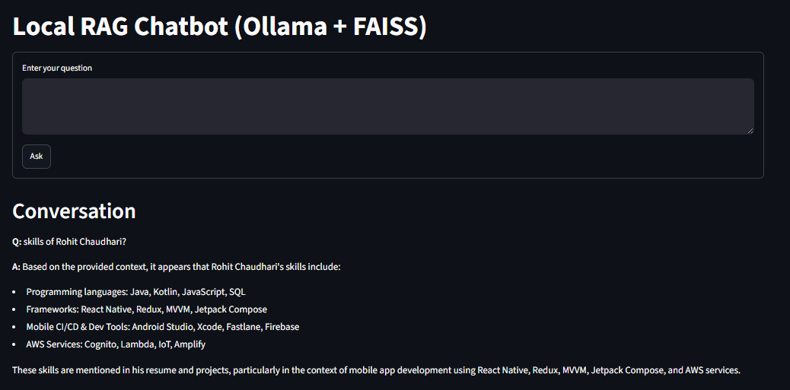

# Local RAG Chatbot for Engineering Knowledge

This project is a local-first chatbot that lets you upload engineering documents, build a searchable knowledge base, and ask questions about them using a local LLM and FAISS vector search.

It also includes a support-message classifier tab for categorizing incoming messages into:
- billing
- technical issues
- general inquiry

## Features

- Upload PDF, DOCX, TXT, and Markdown files
- Build a local FAISS vector index
- Retrieve relevant chunks from your documents
- Generate answers using a local Ollama model
- Classify support messages with a dedicated tab
- Works fully offline except for the local Ollama runtime

## Requirements

Before setup, make sure you have:
- Python 3.10 or newer
- Ollama installed and running locally
- Internet access for the first model download

## 1. Install Ollama

Install Ollama from the official website:
- https://ollama.com/

After installation, start Ollama and pull the required models:

```bash
ollama pull llama3.2:1b
ollama pull nomic-embed-text-v2-moe:latest
```

You can verify that Ollama is working with:

```bash
ollama list
```

## 2. Set up the Python environment

From the project root:

```bash
cd rag-chatbot
python -m venv .venv
```

On Windows PowerShell:

```powershell
.\.venv\Scripts\Activate.ps1
```

On Linux/macOS:

```bash
source .venv/bin/activate
```

Install the required Python packages:

```bash
pip install -r requirements.txt
```

## 3. Run the app

Start the Streamlit application:

```bash
cd rag-chatbot
```

```bash
streamlit run app.py
```

The app will open in your browser.

## 4. How to use the app

### A. Build the knowledge base

1. Open the app in your browser.
2. In the sidebar, upload one or more documents.
3. Click Save uploads to raw/.
4. Click Build Index.

The app will read documents from the data/raw folder, split them into chunks, create embeddings, and build the local FAISS index.

### B. Ask questions

1. Open the RAG Chatbot tab.
2. Type your question in the input box.
3. Click Ask.

The chatbot will retrieve relevant chunks and generate an answer based on your indexed documents.

### C. Classify support messages

1. Open the Message Classifier tab.
2. Paste a customer support message.
3. Click Classify.

The app will classify the message as billing, technical issues, or general inquiry.

## 5. Project structure

```text
rag-chatbot/
├── app.py
├── config/
├── data/
│   └── raw/
├── ingestion/
├── prompts/
├── retrieval/
├── evaluation/
├── requirements.txt
└── vector_store/
```

## 6. Configuration

The app uses default settings in the config module. You can override them with environment variables if needed:

```bash
set RAG_LLM_MODEL=llama3.2:1b
set RAG_EMBEDDING_MODEL=nomic-embed-text-v2-moe:latest
set OLLAMA_BASE_URL=http://localhost:11434
```

## 7. Troubleshooting

### Ollama connection issues

If the app cannot connect to Ollama:
- Make sure Ollama is running
- Check that the service is available at http://localhost:11434
- Pull the required models again if necessary

### No documents found

If the index build says no documents are found:
- Place files in the data/raw folder
- Make sure the file extensions are supported

### Windows dependency issues

If installation fails on Windows, try:

```powershell
pip install --user -r requirements.txt
```

## 8. Sample Responses

#### A. Chatbot


#### B. Classify support messages

```
{
  "category": "General Inquiry",
  "confidence": 0.98,
  "reasoning": "Customer is requesting general business information."
}
```


## 9. Notes

This application is designed to be local and privacy-friendly. Your documents stay on your machine, and the generated responses rely on the locally running Ollama models.


---------------------------------------------------------------------


